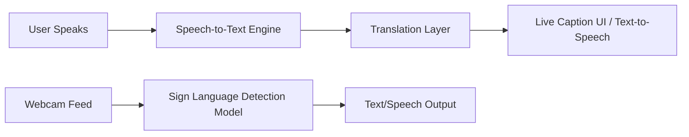

# 🧠 EasySpeak – Real-Time Chrome Extension for Inclusive Communication

**EasySpeak** is a Chrome Extension designed to bridge the communication gap between hearing users and individuals who are deaf or mute. It offers real-time, two-way translation between speech, text, and sign language—making digital conversations inclusive, effortless, and accessible to all.

---

## 🔥 Features

- 🎤 **Speech to Text**  
  Convert spoken words into real-time captions for the other person.

- 🗣️ **Text to Speech**  
  Read aloud typed or translated messages—perfect for mute users.

- 🤟 **Sign Language Detection (via Webcam)**  
  Detects and interprets sign language gestures into text/speech using AI.

- 🌍 **Multilingual Support**  
  Automatically translates speech/text into multiple languages.

- 🔁 **Bi-directional Communication**  
  Enable seamless conversations between speaking and non-speaking users.

- 🧩 **Lightweight Chrome Extension**  
  Runs efficiently inside your browser—no extra apps needed.

---

## 📸 Real Use Case

Imagine you're in a Google Meet with someone who uses sign language.  
- You speak → they see live captions or translated text.  
- They sign → you hear the translation or read it in your language.  
Real-time. Inclusive. Effortless.

---

## 🛠️ Tech Stack

| Purpose | Tech/Tool |
|--------|------------|
| Speech to Text | Web Speech API / Whisper API |
| Text to Speech | Web Speech API |
| Sign Language Detection | TensorFlow.js + MediaPipe Hands |
| Translation | Google Translate API / DeepL |
| Extension Framework | HTML, CSS, JavaScript |
| Model Training (optional) | Python, TensorFlow, OpenCV |

---

## 🧩 Architecture Overview



## 🚀 Getting Started
1. Clone the Repo

```
git clone https://github.com/GTAJIT/EasySpeak.git
cd EasySpeak
```

2. Load Extension in Chrome

- Open chrome://extensions/
- Enable Developer Mode
- Click Load Unpacked
- Select the /extension directory

## 🤝 Contributing
Contributions are welcome! 
Please open issues, suggest features, or submit pull requests to make EasySpeak even better.